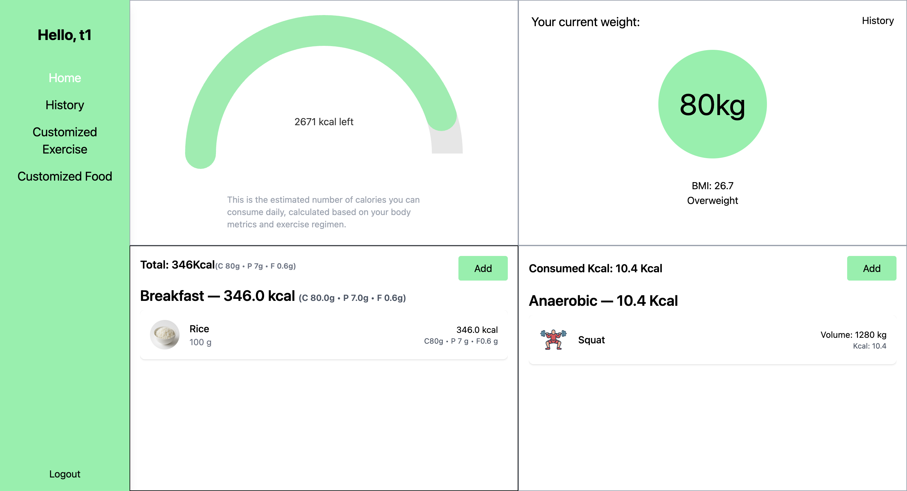
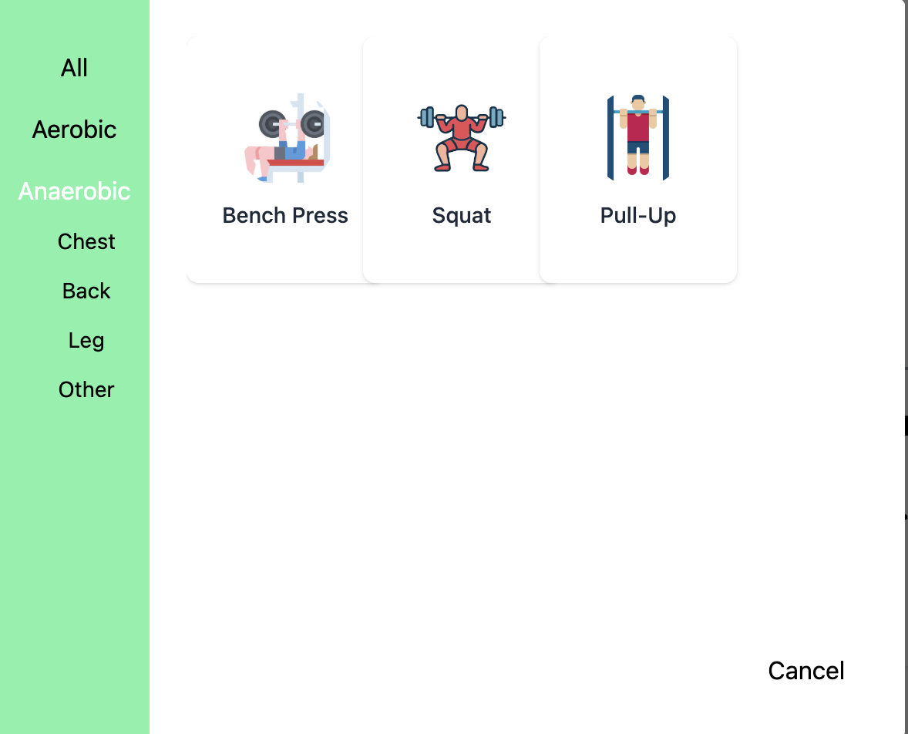
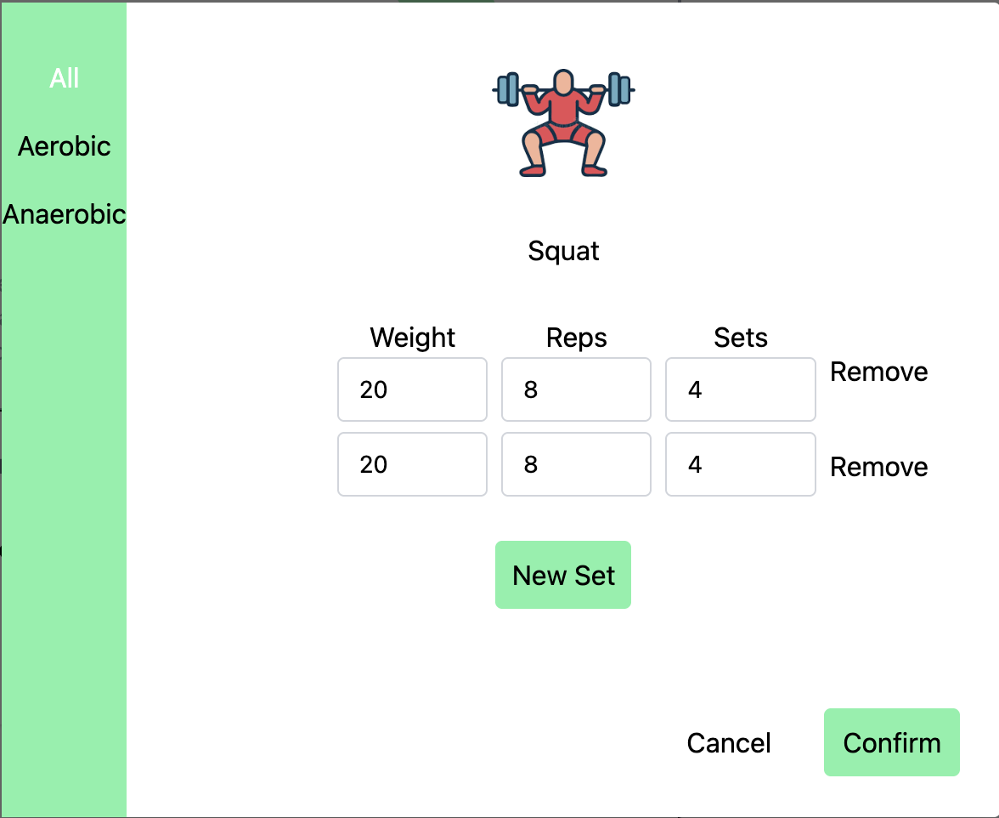
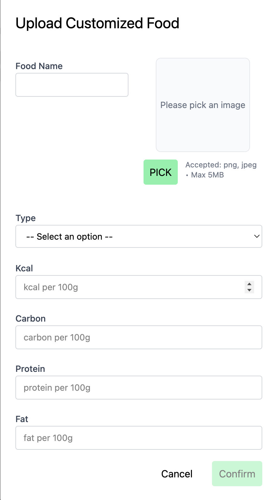
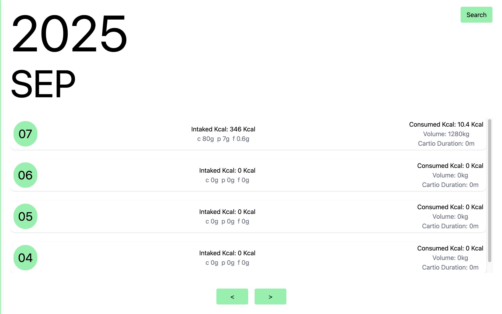

# FitTrack — Front End

A modern, responsive fitness-tracking web app built with **React 19**, **TypeScript**, **Vite**, and **Tailwind CSS**. It lets users track workouts, meals, weight history, and overall health metrics with clean charts and smooth UI animations.



## Table of Contents

- [Features](#features)
- [Tech Stack](#tech-stack)
- [Screenshots](#screenshots)
- [Project Structure](#project-structure)
- [Environment Variables](#environment-variables)
- [Getting Started](#getting-started)
- [Dev Scripts](#dev-scripts)
- [Conventions](#conventions)
- [Common Issues](#common-issues)
- [License](#license)

## Features

- **Auth & Protected Routes** — JWT-based login/signup, route protection via `ProtectionRoute`.
- **Workout Management** — Upload & manage **exercises** (customized + pool).
- **Diet Tracking** — Upload foods, log meals, and view macro breakdowns.
- **Health & History** — Weight history, per-day activity, and historical views.
- **Rich UI** — Tailwind v4 styling, Framer Motion animations, Lucide icons.
- **Charts** — Visualize progress with **Recharts**.
- **State & Context** — Auth/User/Pool contexts + custom hooks (`useHttp`, `useForm`, etc.).
- **Fast Dev** — Vite 7, hot reload, ESLint + TypeScript for safety.

## Tech Stack

- **Framework**: React 19, React Router 7
- **Language**: TypeScript
- **Build**: Vite 7
- **Styling**: Tailwind CSS v4 (`@tailwindcss/vite` plugin)
- **Animations**: Framer Motion
- **Icons**: lucide-react
- **Charts**: Recharts
- **Auth utils**: jwt-decode
- **Linting**: ESLint + typescript-eslint

## Screenshots

- Exercise List  
  
- Add Exercise  
  
- Upload Customized Food  
  
- History Page  
  

## Project Structure

```plaintext
FitTrack_Front/
├─ index.html
├─ package.json
├─ vite.config.ts
├─ tsconfig*.json
├─ public/
├─ screenshots/
│  ├─ dashboard.jpg
│  ├─ exerciseList.jpg
│  └─ addDietForm.jpg
└─ src/
   ├─ App.tsx
   ├─ main.tsx
   ├─ index.css                      # Tailwind entry (@import "tailwindcss")
   ├─ pages/
   │  ├─ main/                       # Home, Exercises, Diet, Health
   │  └─ user/                       # SideLayout, UserHome, WeightHistory, History
   ├─ shared/
   │  ├─ components/
   │  │  ├─ form/                    # Signup, Login, UploadFoodForm, UploadExForm, WeightForm, etc.
   │  │  └─ routes/ProtectionRoute.tsx
   │  ├─ context/
   │  │  ├─ AuthContext.tsx
   │  │  ├─ UserContext/
   │  │  └─ PoolConetext.tsx
   │  └─ hooks/                      # useHttp, useForm, useInput, etc.
   └─ ...                            # utilities, types, etc.
```
## Environment Variables

To run this project, you will need to add the following environment variable to your `.env` file in the project root:

```bash
VITE_BACKEND_URL=https://your-backend-domain.tld/api
```

## Getting Started

Follow these steps to set up the project locally.

### Prerequisites
- **Node.js ≥ 18** (LTS recommended)
- **npm** (comes with Node.js)

### Installation
Clone the repo and install dependencies:

```bash
git clone https://github.com/Guotai812/FitTrack_Front.git
cd FitTrack_Front
npm install
```

### Install Dependency
```bash
npm install
```

### Configure Enviroment Variables
Create a .env file in the project root and add:
```bash
VITE_BACKEND_URL=https://your-backend-domain.tld/api
```

### Start Development Server
Run the Vite development server
```bash
npm run dev
```

### Build for Production
Generate an optimized production build:
```bash
npm run build
```

### Preview Production Build
Preview the production build locally:
```bash
npm run preview
```

## Dev Scripts

The following npm scripts are available in this project:

| Script            | Description                               |
|-------------------|-------------------------------------------|
| `npm run dev`     | Start the Vite development server          |
| `npm run build`   | Type-check and build the app for production |
| `npm run preview` | Preview the production build locally       |
| `npm run lint`    | Run ESLint to check for linting errors     |

## Conventions

This project follows a few conventions for consistency and maintainability.

### Routing
- All routes are declared in `App.tsx` using **React Router 7**.
- Auth-protected sections are wrapped with `<ProtectionRoute>`, e.g., for `SideLayout`.

### Styling
- Tailwind CSS v4 is used with the official Vite plugin.
- `index.css` contains the entry point with `@import "tailwindcss";`.
- Components are styled using Tailwind utility classes (no custom PostCSS setup required).

### State & Context
- `AuthContext` — manages user sessions, JWTs, and login/logout logic.
- `UserContext` — stores user profile and related state.
- `PoolConetext` — manages exercise and food pools.

### HTTP & Forms
- `useHttp` — centralized wrapper for API requests.
- `useForm`, `useInput`, and `validator` — handle form state and validation across components.

## Common Issues

### CORS Errors
If you see CORS errors when making API requests, make sure your backend is configured to allow your front-end origin. Typical headers:
- Access-Control-Allow-Origin: https://your-frontend-domain
- Access-Control-Allow-Headers: Origin, X-Requested-With, Content-Type, Accept, Authorization
-	Access-Control-Allow-Methods: GET, POST, PATCH, DELETE, OPTIONS

## License

This project is currently **unlicensed/private**.  
You are free to use it for personal purposes, but redistribution, modification, or commercial use is not permitted unless a license is added.

---

📌 If you want to make this project open-source, it’s common to add a license file such as:

- [MIT License](https://opensource.org/licenses/MIT) — very permissive, widely used.
- [Apache 2.0](https://opensource.org/licenses/Apache-2.0) — similar to MIT, but with explicit patent rights.
- [GPL v3](https://www.gnu.org/licenses/gpl-3.0.en.html) — requires derivatives to also be open-source.

To add a license:
1. Create a file named `LICENSE` in the project root.
2. Paste the text of your chosen license.
3. Update this section to reflect it.